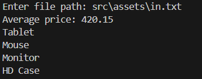

# ProductStreamProcessor

Este projeto demonstra o uso de Streams em Java para processar e manipular dados de um arquivo de entrada. Ele calcula o preço médio de uma lista de produtos e exibe os nomes dos produtos que possuem preço abaixo da média, ordenados em ordem decrescente.

## Estrutura do Projeto


### Arquivos principais:
- **App.java**: Classe principal que contém a lógica do programa.
- **Product.java**: Classe que representa um produto com nome e preço.
- **in.txt**: Arquivo de entrada com os dados de produtos no formato `nome,preço`.
- **result.png**: Imagem de exemplo com o resultado do programa.

## Funcionalidades

1. **Leitura de Arquivo**:
   - Lê dados de um arquivo no formato CSV (`nome,preço`).
   - Exemplo do conteúdo de `in.txt`:
     ```
     TV,900.00
     Mouse,50.00
     Keyboard,120.00
     Monitor,320.00
     ```

2. **Cálculo da Média**:
   - Calcula o preço médio de todos os produtos.

3. **Filtragem e Ordenação**:
   - Filtra os produtos com preço abaixo da média.
   - Ordena os nomes dos produtos em ordem decrescente.

### Exemplo de Entrada

Arquivo `src/assets/in.txt`:

### Exemplo Visual de Saída

A imagem abaixo ilustra a execução do programa:


